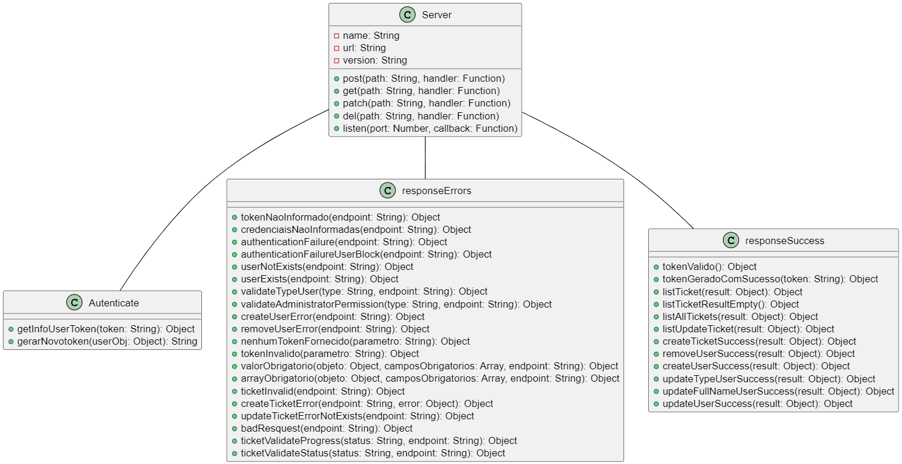
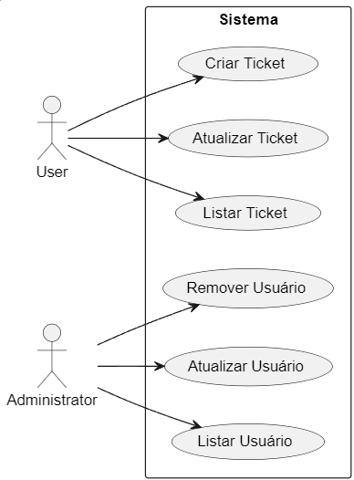

# Plataforma de Atendimento ao Cliente Lover's Pet

## Descrição

Esta é uma plataforma web destinada ao atendimento de clientes e seus Pets. Ela foi projetada para facilitar a interação entre prestador de serviço e clientes.

## Funcionalidades

### Administradores

Os prestador de serviço têm a capacidade de gerenciar usuários na plataforma. Eles podem:

- Cadastrar novos usuários
- Editar informações de usuários existentes
- Criar novos usuários
- Excluir usuários

### Clientes

Os clientes têm a capacidade de gerenciar suas próprias contas na plataforma. Eles podem:

- Fazer agendamento de serviços
- Cancelar serviços agendados

### Diagrama de Classe

#### Classes:

- **server**: Representa o servidor da aplicação.
- **responseSuccess**: Uma classe que lida com as respostas de sucesso retornadas pela API.
- **responseErrors**: Uma classe que lida com as respostas de erro retornadas pela API.
- **Autenticate**: Classe responsável pela autenticação dos usuários.
- **mongoose**: Biblioteca para interação com o MongoDB.
- **restify**: Framework para criação de APIs RESTful.
- **jwt**: Biblioteca para geração e verificação de tokens JWT.
- **dotenv**: Biblioteca para carregar variáveis de ambiente a partir de um arquivo .env.

#### Atributos:

- Nas classes `responseSuccess` e `responseErrors`, há atributos como `response`, `success`, `message`, `data`, etc., que são utilizados para construir e retornar respostas HTTP consistentes.

#### Relacionamentos:

- Entre as classes `responseSuccess` e `responseErrors`, há uma composição, indicando que essas classes são compostas por objetos de resposta HTTP.
- As classes `Autenticate`, `mongoose`, `restify`, `jwt`, e `dotenv` estão relacionadas ao servidor `server`, indicando que são componentes utilizados pelo servidor para funcionar.

O diagrama de classe fornece uma visão geral da estrutura do sistema, permitindo entender como as diferentes partes se relacionam e como funcionam em conjunto para fornecer a funcionalidade desejada.

### Diagrama Caso de Uso

#### Casos de Uso:

- **Login**: Permite que o usuário realize o login no sistema.
- **Validar Token**: Possibilita a validação de um token de autenticação.
- **Listar Tickets**: Permite ao usuário listar os tickets disponíveis no sistema.
- **Consultar Ticket**: Oferece a funcionalidade de consultar detalhes de um ticket específico.
- **Atualizar Ticket**: Permite ao usuário solicitar a atualização de um ticket.
- **Adicionar Interacao**: Possibilita ao usuário adicionar uma nova interação em um ticket.
- **Criar Ticket**: Permite ao usuário criar um novo ticket.
- **Listar Usuários**: Permite ao usuário listar todos os usuários cadastrados no sistema.
- **Remover Usuário**: Permite ao usuário remover um usuário do sistema.
- **Criar Usuário**: Permite ao usuário criar um novo usuário no sistema.
- **Atualizar Usuário**: Oferece a funcionalidade de atualizar informações de um usuário existente no sistema.

#### Ator:

- **Usuário**: Interage com os casos de uso.

#### Sistema Lovers Pet:

- É o sistema em si, com todos os casos de uso disponíveis.

## Como Usar

Para começar a usar a plataforma, os administradores precisam cadastrar os usuários e os clientes precisam criar uma conta. Depois disso, os clientes podem começar a agendar ou cancelar serviços.

Esperamos que você ache esta plataforma útil e fácil de usar. Se tiver alguma dúvida ou sugestão, não hesite em nos contatar.
